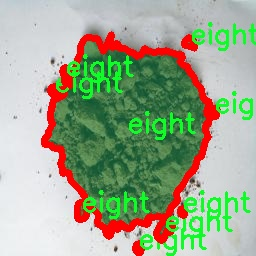

# 土壤PH值分类图像分割系统： yolov8-seg-C2f-EMBC

### 1.研究背景与意义

[参考博客](https://gitee.com/YOLOv8_YOLOv11_Segmentation_Studio/projects)

[博客来源](https://kdocs.cn/l/cszuIiCKVNis)

研究背景与意义

土壤pH值是影响植物生长和土壤健康的重要因素，直接关系到农业生产的可持续性和生态环境的保护。随着全球气候变化和人类活动的加剧，土壤酸碱度的变化愈发显著，如何有效监测和管理土壤pH值成为了农业科学和环境科学领域的重要研究课题。传统的土壤pH值测量方法多依赖于实验室分析，不仅耗时耗力，而且难以实现大范围的实时监测。因此，基于图像处理和深度学习技术的土壤pH值分类与分割系统应运而生，成为了提升土壤管理效率的重要工具。

在这一背景下，YOLO（You Only Look Once）系列目标检测算法因其高效性和实时性而受到广泛关注。YOLOv8作为该系列的最新版本，具备更强的特征提取能力和更快的处理速度，能够在复杂环境中进行高精度的图像分类与分割。通过对YOLOv8进行改进，结合土壤pH值的特征，我们可以构建一个高效的土壤pH值分类图像分割系统。该系统不仅能够自动识别和分类不同pH值的土壤样本，还能为农业生产提供科学依据，帮助农民制定合理的施肥和土壤改良方案。

本研究所使用的数据集“spH_classification_fnl”包含1000幅图像，涵盖了四个不同的土壤pH值类别（六、七、八、九），为模型的训练和验证提供了丰富的样本。通过对这些图像进行实例分割，我们能够更精确地识别土壤样本的pH值分布情况。这种方法不仅提高了分类的准确性，还能够为后续的土壤管理提供更为细致的空间信息。

在实际应用中，改进YOLOv8的土壤pH值分类图像分割系统能够广泛应用于农业监测、土壤健康评估以及生态环境保护等领域。通过实时监测土壤pH值的变化，农民可以及时调整种植策略，减少化肥和农药的使用，从而实现精准农业。同时，该系统也为科研人员提供了一个高效的工具，以便于开展土壤酸碱度变化对生态系统影响的研究。

综上所述，基于改进YOLOv8的土壤pH值分类图像分割系统不仅具有重要的理论价值，还有着广泛的实际应用前景。通过提升土壤pH值监测的效率和准确性，该研究将为实现可持续农业和生态环境保护提供重要支持，推动相关领域的进一步发展。

### 2.图片演示


注意：本项目提供完整的训练源码数据集和训练教程,由于此博客编辑较早,暂不提供权重文件（best.pt）,需要按照6.训练教程进行训练后实现上图效果。

### 3.视频演示

[3.1 视频演示](https://www.bilibili.com/video/BV1y7mdYREmw/)

### 4.数据集信息

##### 4.1 数据集类别数＆类别名

nc: 4
names: ['eight', 'nine', 'seven', 'six']


##### 4.2 数据集信息简介

数据集信息展示

在本研究中，我们使用了名为“spH_classification_fnl”的数据集，以训练和改进YOLOv8-seg模型，旨在实现土壤pH值的分类图像分割。该数据集的设计旨在提供丰富的图像样本，以支持对不同pH值土壤的准确分类和分割，进而为农业科学、环境监测和土壤管理等领域提供重要的技术支持。

“spH_classification_fnl”数据集包含四个主要类别，分别为“six”、“seven”、“eight”和“nine”。这些类别代表了不同的土壤pH值范围，具体而言，pH值的变化对于植物生长和土壤健康具有重要影响。通过对这些类别的细致划分，研究者能够更好地理解土壤的化学特性，并制定相应的管理策略，以提高土壤的肥力和作物的产量。

在数据集的构建过程中，研究团队精心挑选了来自不同地理区域和气候条件下的土壤样本，以确保数据的多样性和代表性。每个类别下的图像均经过严格标注，确保每张图像都能准确反映出其对应的pH值。这种高质量的标注不仅提升了模型训练的有效性，也为后续的图像分割任务提供了坚实的基础。

数据集中的图像涵盖了多种拍摄角度和光照条件，旨在模拟实际应用场景中的复杂性。这种多样性使得训练出的YOLOv8-seg模型能够更好地适应不同环境下的土壤pH值识别任务，提高了模型的泛化能力。此外，数据集中还包含了一些背景杂物和干扰元素，以增强模型在实际应用中的鲁棒性，确保其在复杂背景下仍能准确识别和分割土壤pH值。

在数据预处理阶段，我们对图像进行了标准化处理，包括调整图像尺寸、增强对比度和亮度等，以提升模型的训练效果。通过这些预处理步骤，研究团队确保了数据集的高质量和一致性，为后续的深度学习模型训练奠定了坚实的基础。

总之，“spH_classification_fnl”数据集的构建和应用为土壤pH值分类图像分割系统的研究提供了重要的支持。通过使用该数据集，我们能够训练出更为精确和高效的YOLOv8-seg模型，进而推动土壤科学研究的发展，帮助农业从业者和环境科学家更好地理解和管理土壤资源。未来，我们期望通过不断优化数据集和模型，进一步提升土壤pH值分类的准确性和效率，为可持续农业和生态环境保护贡献更多的力量。




### 5.项目依赖环境部署教程（零基础手把手教学）

[5.1 环境部署教程链接（零基础手把手教学）](https://www.bilibili.com/video/BV1jG4Ve4E9t/?vd_source=bc9aec86d164b67a7004b996143742dc)


[5.2 安装Python虚拟环境创建和依赖库安装视频教程链接（零基础手把手教学）](https://www.bilibili.com/video/BV1nA4VeYEze/?vd_source=bc9aec86d164b67a7004b996143742dc)

### 6.手把手YOLOV8-seg训练视频教程（零基础手把手教学）

[6.1 手把手YOLOV8-seg训练视频教程（零基础小白有手就能学会）](https://www.bilibili.com/video/BV1cA4VeYETe/?vd_source=bc9aec86d164b67a7004b996143742dc)


按照上面的训练视频教程链接加载项目提供的数据集，运行train.py即可开始训练



     Epoch   gpu_mem       box       obj       cls    labels  img_size
     1/200     0G   0.01576   0.01955  0.007536        22      1280: 100%|██████████| 849/849 [14:42<00:00,  1.04s/it]
               Class     Images     Labels          P          R     mAP@.5 mAP@.5:.95: 100%|██████████| 213/213 [01:14<00:00,  2.87it/s]
                 all       3395      17314      0.994      0.957      0.0957      0.0843

     Epoch   gpu_mem       box       obj       cls    labels  img_size
     2/200     0G   0.01578   0.01923  0.007006        22      1280: 100%|██████████| 849/849 [14:44<00:00,  1.04s/it]
               Class     Images     Labels          P          R     mAP@.5 mAP@.5:.95: 100%|██████████| 213/213 [01:12<00:00,  2.95it/s]
                 all       3395      17314      0.996      0.956      0.0957      0.0845

     Epoch   gpu_mem       box       obj       cls    labels  img_size
     3/200     0G   0.01561    0.0191  0.006895        27      1280: 100%|██████████| 849/849 [10:56<00:00,  1.29it/s]
               Class     Images     Labels          P          R     mAP@.5 mAP@.5:.95: 100%|███████   | 187/213 [00:52<00:00,  4.04it/s]
                 all       3395      17314      0.996      0.957      0.0957      0.0845


### 7.50+种全套YOLOV8-seg创新点加载调参实验视频教程（一键加载写好的改进模型的配置文件）

[7.1 50+种全套YOLOV8-seg创新点加载调参实验视频教程（一键加载写好的改进模型的配置文件）](https://www.bilibili.com/video/BV1Hw4VePEXv/?vd_source=bc9aec86d164b67a7004b996143742dc)

### YOLOV8-seg算法简介

原始YOLOv8-seg算法原理

YOLOv8-seg算法是YOLO系列中的一个重要进展，旨在将目标检测与语义分割相结合，形成一种更为全面的视觉理解能力。作为YOLOv8的扩展版本，YOLOv8-seg不仅保留了YOLOv8在目标检测方面的高效性和准确性，还引入了语义分割的特性，使得模型能够在处理复杂场景时，提供更为细致的像素级别的目标识别能力。

首先，YOLOv8-seg算法的核心在于其网络结构的设计，依然遵循YOLO系列的基本框架，包括主干网络（Backbone）、特征增强网络（Neck）和检测头（Head）。主干网络采用了CSPNet（Cross Stage Partial Network）结构，旨在通过分段处理来减少计算量并提高特征提取的效率。CSPNet通过将特征图分为两部分，分别进行不同的处理，然后再合并，能够有效提升模型的表达能力，尤其是在处理复杂背景和多样化目标时，能够更好地提取有用特征。

在特征增强网络部分，YOLOv8-seg采用了PAN-FPN（Path Aggregation Network - Feature Pyramid Network）的思想，通过上采样和下采样的结合，融合不同尺度的特征图。这种特征融合策略使得模型能够在多尺度下对目标进行有效的检测和分割，尤其是在面对小目标或背景复杂的场景时，能够显著提高模型的鲁棒性和准确性。

YOLOv8-seg的检测头部分则是其最具创新性的地方。与传统的耦合头不同，YOLOv8-seg采用了解耦头结构，将分类和回归任务分为两个独立的分支。这样的设计使得每个任务可以更加专注于自身的目标，减少了在复杂场景下可能出现的定位不准和分类错误的问题。此外，YOLOv8-seg还引入了Anchor-free的目标检测方法，直接通过回归方式预测目标的位置和大小，省去了传统方法中繁琐的锚点框定义和调整过程。这种方法不仅提高了检测速度，还提升了对不同形状和尺度目标的适应能力，使得模型在实际应用中表现得更加灵活。

在具体的训练过程中，YOLOv8-seg利用了Task-Aligned Assigner方法，对分类和回归的分数进行加权匹配，以此提高正样本的匹配精度。同时，损失计算方面，YOLOv8-seg采用了BCE（Binary Cross-Entropy）损失函数来计算分类损失，并使用DFL（Distribution Focal Loss）和CIoU（Complete Intersection over Union）损失函数来计算回归损失。这种多样化的损失函数设计，能够有效提升模型的训练效果，使得YOLOv8-seg在处理复杂场景时，能够更好地进行目标检测和语义分割。

值得注意的是，YOLOv8-seg在实际应用中展现出了强大的能力，尤其是在实时检测和分割任务中，能够在保持高精度的同时，确保快速的推理速度。这使得YOLOv8-seg成为了许多嵌入式设备和实时监控系统的理想选择。其轻量化的模型设计，使得它能够在资源受限的环境中运行，满足了现代计算需求的多样性。

然而，尽管YOLOv8-seg在许多方面都表现出色，但在一些特定场景下，仍然存在一定的挑战。例如，在复杂的水面环境中，由于小目标漂浮物的特征复杂，背景多样，YOLOv8-seg可能会面临定位误差和对目标感知能力不足的问题。为了解决这些问题，研究者们提出了一些改进方案，如引入BiFormer双层路由注意力机制，构建C2fBF模块，以保留特征提取过程中更细粒度的上下文信息，提升模型对小目标的感知能力。

综上所述，YOLOv8-seg算法通过其创新的网络结构和高效的训练策略，成功地将目标检测与语义分割结合在一起，展现了强大的视觉理解能力。随着技术的不断进步，YOLOv8-seg无疑将在更多的应用场景中发挥重要作用，推动计算机视觉领域的发展。


### 9.系统功能展示（检测对象为举例，实际内容以本项目数据集为准）

图9.1.系统支持检测结果表格显示

  图9.2.系统支持置信度和IOU阈值手动调节

  图9.3.系统支持自定义加载权重文件best.pt(需要你通过步骤5中训练获得)

  图9.4.系统支持摄像头实时识别

  图9.5.系统支持图片识别

  图9.6.系统支持视频识别

  图9.7.系统支持识别结果文件自动保存

  图9.8.系统支持Excel导出检测结果数据


### 10.50+种全套YOLOV8-seg创新点原理讲解（非科班也可以轻松写刊发刊，V11版本正在科研待更新）

#### 10.1 由于篇幅限制，每个创新点的具体原理讲解就不一一展开，具体见下列网址中的创新点对应子项目的技术原理博客网址【Blog】：


[10.1 50+种全套YOLOV8-seg创新点原理讲解链接](https://gitee.com/qunmasj/good)

#### 10.2 部分改进模块原理讲解(完整的改进原理见上图和技术博客链接)【如果此小节的图加载失败可以通过CSDN或者Github搜索该博客的标题访问原始博客，原始博客图片显示正常】
### YOLOv8模型原理

YOLOv8是YOLO系列最新的模型,具有非常优秀的检测精度和速度。根据网络的深度与特征图的宽度大小, YOLOv8算法分为:YOLOv8-n、YOLOv8一s 、YOLOv8-m 、 YOLOv8-l、和 YOLOv8-x 5个版本。按照网络结构图,YOLOv8可分为: Inpul 、 Backbone , Neck和Head 4部分。


Backbone采用了CSPDarknet 架构，由CBS (标准卷积层)、C2f模块和 SPPF(金字塔池化）组成。通过5次标准卷积层和C2f模块逐步提取图像特征，并在网络末尾添加SPPF模块，将任意大小的输入图像转换成固定大小的特征向量。分别取P3、P4、P5层的特征提取结果，向Head输出80×80、40 × 40、20×20三个尺度的特征层。
C2f模块借鉴了残差网络(ResNet)以及ELAN的思想，其结构分为两个分支，主干部分利用Bottleneckm2%模块逐步加深网络，分支部分保留输入层通道并与主干部分特征进行融合，如图所示。通过标准卷积层提取新的特征层，相比于YOLOv5使用的C3模块，C2f模块可以在卷积层和全连接层之间建立一个平滑的转换，从而实现了参数的共享，提高了模型的效率和泛化能力。
Head采用了PAN-FPN 结构,将 Backbone输入的3个特征层进行多尺度融合，进行自顶向下(FAN)和自底向上 (PAN)的特征传递，对金字塔进行增强，使不同尺寸的特征图都包含强目标语义信息和强目标特征信息，保证了对不同尺寸样本的准确预测。
Detect借鉴了Decoupled-Head 思想，用一个解耦检测头将输入的不同尺寸特征层分成2个分支进行检测。第1个分支在进行3次卷积后使进行回归任务，输出预测框。第2个分支在进行3次卷积后进行分类任务，输出类别的概率。采用Varifocal_Loss2”作为损失函数，其式为:


### Context_Grided_Network(CGNet)简介
参考该博客提出的一种轻量化语义分割模型Context Grided Network(CGNet)，以满足设备的运行需要。

CGNet主要由CG块构建而成，CG块可以学习局部特征和周围环境上下文的联合特征，最后通过引入全局上下文特征进一步改善联合特征的学习。


 
下图给出了在Cityscapes数据集上对现有的一些语义分割模型的测试效果，横轴表示参数量，纵轴表示准确率(mIoU)。可以看出，在参数量较少的情况下，CGNet可以达到一个比较好的准确率。虽与高精度模型相去甚远，但在一些对精度要求不高、对实时性要求比较苛刻的情况下，很有价值。


高精度模型，如DeepLab、DFN、DenseASPP等，动不动就是几十M的参数，很难应用在移动设备上。而上图中红色的模型，相对内存占用较小，但它们的分割精度却不是很高。作者认为主要原因是，这些小网络大多遵循着分类网络的设计思路，并没有考虑语义分割任务更深层次的特点。

空间依赖性和上下文信息对提高分割精度有很大的作用。作者从该角度出发，提出了CG block，并进一步搭建了轻量级语义分割网络CGNet。CG块具有以下特点： 

学习局部特征和上下文特征的联合特征；
通过全局上下文特征改进上述联合特征；
可以贯穿应用在整个网络中，从low level（空间级别）到high level（语义级别）。不像PSPNet、DFN、DenseASPP等，只在编码阶段以后捕捉上下文特征。；
只有3个下采样，相比一般5个下采样的网络，能够更好地保留边缘信息。
CGNet遵循“深而薄”的原则设计，整个网络又51层构成。其中，为了降低计算，大量使用了channel-wise conv.

小型语义分割模型：

需要平衡准确率和系统开销
进化路线：ENet -> ICNet -> ESPNet
这些模型基本都基于分类网络设计，在分割准确率上效果并不是很好
上下文信息模型：

大多数现有模型只考虑解码阶段的上下文信息并且没有利用周围的上下文信息
注意力机制：

CG block使用全局上下文信息计算权重向量，并使用其细化局部特征和周围上下文特征的联合特征

#### Context Guided Block
CG block由4部分组成：


此外，CG block还采用了残差学习。文中提出了局部残差学习（LRL）和全局残差学习（GRL）两种方式。 LRL添加了从输入到联合特征提取器的连接，GRL添加了从输入到全局特征提取器的连接。从直观上来说，GRL比LRL更能促进网络中的信息传递（更像ResNet~~），后面实验部分也进行了测试，的确GRL更能提升分割精度。


CGNet的通用网络结构如下图所示，分为3个stage，第一个stage使用3个卷积层抽取特征，第二和第三个stage堆叠一定数量的CG block，具体个数可以根据情况调整。最后，通过1x1 conv得到分割结果。


下图是用于Cityscapes数据集的CGNet网络细节说明：输入尺寸为3*680*680；stage1连续使用了3个Conv-BN-PReLU组合，首个组合使用了stride=2的卷积，所以得到了1/2分辨率的feature map；stage2和stage3分别使用了多个CG block，且其中使用了不同大小的膨胀卷积核，最终分别得到了1/4和1/8的feature map。

需注意：

stage2&3的输入特征分别由其上一个stage的首个和最后一个block组合给出（参考上图的绿色箭头）；

输入注入机制，图中未体现，实际使用中，作者还将输入图像下采样1/4或1/8，分别给到stage2和stage3的输入中 ，以进一步加强特征传递。

channel-wise conv。为了缩减参数数量，在局部特征提取器和周围上下文特征提取器中使用了channel-wise卷积，可以消除跨通道的计算成本，同时节省内存占用。但是，没有像MobileNet等模型一样，在depth-wise卷积后面接point-wise卷积（1*1 conv），作者解释是，因为CG block需要保持局部特征和周围上下文特征的独立性，而1*1 conv会破坏这种独立性，所以效果欠佳，实验部分也进行了验证。

个人感觉此处应该指的是depth-wise卷积？

官方Git中对该部分的实现如下：


### 11.项目核心源码讲解（再也不用担心看不懂代码逻辑）

#### 11.1 ultralytics\nn\backbone\lsknet.py

以下是经过精简和注释的核心代码部分：

```python
import torch
import torch.nn as nn
from torch.nn.modules.utils import _pair as to_2tuple
from functools import partial

class Mlp(nn.Module):
    """多层感知机（MLP）模块"""
    def __init__(self, in_features, hidden_features=None, out_features=None, act_layer=nn.GELU, drop=0.):
        super().__init__()
        out_features = out_features or in_features  # 输出特征数
        hidden_features = hidden_features or in_features  # 隐藏层特征数
        self.fc1 = nn.Conv2d(in_features, hidden_features, 1)  # 第一层卷积
        self.dwconv = DWConv(hidden_features)  # 深度卷积
        self.act = act_layer()  # 激活函数
        self.fc2 = nn.Conv2d(hidden_features, out_features, 1)  # 第二层卷积
        self.drop = nn.Dropout(drop)  # Dropout层

    def forward(self, x):
        x = self.fc1(x)
        x = self.dwconv(x)
        x = self.act(x)
        x = self.drop(x)
        x = self.fc2(x)
        x = self.drop(x)
        return x


class LSKblock(nn.Module):
    """LSK模块"""
    def __init__(self, dim):
        super().__init__()
        self.conv0 = nn.Conv2d(dim, dim, 5, padding=2, groups=dim)  # 深度卷积
        self.conv_spatial = nn.Conv2d(dim, dim, 7, stride=1, padding=9, groups=dim, dilation=3)  # 空间卷积
        self.conv1 = nn.Conv2d(dim, dim//2, 1)  # 1x1卷积
        self.conv2 = nn.Conv2d(dim, dim//2, 1)  # 1x1卷积
        self.conv_squeeze = nn.Conv2d(2, 2, 7, padding=3)  # 压缩卷积
        self.conv = nn.Conv2d(dim//2, dim, 1)  # 1x1卷积

    def forward(self, x):   
        attn1 = self.conv0(x)  # 计算注意力1
        attn2 = self.conv_spatial(attn1)  # 计算注意力2

        attn1 = self.conv1(attn1)  # 1x1卷积
        attn2 = self.conv2(attn2)  # 1x1卷积
        
        attn = torch.cat([attn1, attn2], dim=1)  # 拼接注意力
        avg_attn = torch.mean(attn, dim=1, keepdim=True)  # 平均注意力
        max_attn, _ = torch.max(attn, dim=1, keepdim=True)  # 最大注意力
        agg = torch.cat([avg_attn, max_attn], dim=1)  # 拼接平均和最大注意力
        sig = self.conv_squeeze(agg).sigmoid()  # Sigmoid激活
        attn = attn1 * sig[:,0,:,:].unsqueeze(1) + attn2 * sig[:,1,:,:].unsqueeze(1)  # 加权注意力
        attn = self.conv(attn)  # 最终卷积
        return x * attn  # 输出加权特征


class Attention(nn.Module):
    """注意力模块"""
    def __init__(self, d_model):
        super().__init__()
        self.proj_1 = nn.Conv2d(d_model, d_model, 1)  # 投影层1
        self.activation = nn.GELU()  # 激活函数
        self.spatial_gating_unit = LSKblock(d_model)  # 空间门控单元
        self.proj_2 = nn.Conv2d(d_model, d_model, 1)  # 投影层2

    def forward(self, x):
        shortcut = x.clone()  # 残差连接
        x = self.proj_1(x)
        x = self.activation(x)
        x = self.spatial_gating_unit(x)
        x = self.proj_2(x)
        x = x + shortcut  # 残差连接
        return x


class Block(nn.Module):
    """网络中的基本块"""
    def __init__(self, dim, mlp_ratio=4., drop=0., drop_path=0., act_layer=nn.GELU):
        super().__init__()
        self.norm1 = nn.BatchNorm2d(dim)  # 归一化层1
        self.norm2 = nn.BatchNorm2d(dim)  # 归一化层2
        self.attn = Attention(dim)  # 注意力模块
        self.drop_path = nn.Identity() if drop_path <= 0. else DropPath(drop_path)  # 随机深度
        mlp_hidden_dim = int(dim * mlp_ratio)  # MLP隐藏层维度
        self.mlp = Mlp(in_features=dim, hidden_features=mlp_hidden_dim, drop=drop)  # MLP模块

    def forward(self, x):
        x = x + self.drop_path(self.attn(self.norm1(x)))  # 添加注意力输出
        x = x + self.drop_path(self.mlp(self.norm2(x)))  # 添加MLP输出
        return x


class OverlapPatchEmbed(nn.Module):
    """图像到补丁嵌入"""
    def __init__(self, img_size=224, patch_size=7, stride=4, in_chans=3, embed_dim=768):
        super().__init__()
        patch_size = to_2tuple(patch_size)  # 转换为2元组
        self.proj = nn.Conv2d(in_chans, embed_dim, kernel_size=patch_size, stride=stride,
                              padding=(patch_size[0] // 2, patch_size[1] // 2))  # 卷积嵌入
        self.norm = nn.BatchNorm2d(embed_dim)  # 归一化层

    def forward(self, x):
        x = self.proj(x)  # 嵌入
        x = self.norm(x)  # 归一化
        return x


class LSKNet(nn.Module):
    """LSK网络架构"""
    def __init__(self, img_size=224, in_chans=3, embed_dims=[64, 128, 256, 512],
                 mlp_ratios=[8, 8, 4, 4], drop_rate=0., drop_path_rate=0., depths=[3, 4, 6, 3]):
        super().__init__()
        self.num_stages = len(depths)  # 网络阶段数
        dpr = [x.item() for x in torch.linspace(0, drop_path_rate, sum(depths))]  # 随机深度衰减

        for i in range(self.num_stages):
            patch_embed = OverlapPatchEmbed(img_size=img_size if i == 0 else img_size // (2 ** (i + 1)),
                                            patch_size=7 if i == 0 else 3,
                                            stride=4 if i == 0 else 2,
                                            in_chans=in_chans if i == 0 else embed_dims[i - 1],
                                            embed_dim=embed_dims[i])
            block = nn.ModuleList([Block(dim=embed_dims[i], mlp_ratio=mlp_ratios[i], drop=drop_rate, drop_path=dpr[j])
                                   for j in range(depths[i])])  # 创建块
            norm = nn.LayerNorm(embed_dims[i])  # 归一化层
            setattr(self, f"patch_embed{i + 1}", patch_embed)
            setattr(self, f"block{i + 1}", block)
            setattr(self, f"norm{i + 1}", norm)

    def forward(self, x):
        outs = []
        for i in range(self.num_stages):
            patch_embed = getattr(self, f"patch_embed{i + 1}")
            block = getattr(self, f"block{i + 1}")
            norm = getattr(self, f"norm{i + 1}")
            x = patch_embed(x)  # 嵌入
            for blk in block:
                x = blk(x)  # 通过块
            x = norm(x)  # 归一化
            outs.append(x)  # 保存输出
        return outs


class DWConv(nn.Module):
    """深度卷积模块"""
    def __init__(self, dim=768):
        super(DWConv, self).__init__()
        self.dwconv = nn.Conv2d(dim, dim, 3, 1, 1, bias=True, groups=dim)  # 深度卷积

    def forward(self, x):
        return self.dwconv(x)  # 直接输出


def lsknet_t(weights=''):
    """创建LSKNet_t模型"""
    model = LSKNet(embed_dims=[32, 64, 160, 256], depths=[3, 3, 5, 2])
    if weights:
        model.load_state_dict(torch.load(weights)['state_dict'])  # 加载权重
    return model

if __name__ == '__main__':
    model = lsknet_t('lsk_t_backbone-2ef8a593.pth')  # 实例化模型
    inputs = torch.randn((1, 3, 640, 640))  # 随机输入
    for i in model(inputs):
        print(i.size())  # 输出每层的尺寸
```

### 代码核心部分说明：
1. **Mlp类**：实现了一个多层感知机，包括两个卷积层和一个深度卷积，使用GELU激活函数和Dropout。
2. **LSKblock类**：实现了一个特定的块，使用深度卷积和空间卷积，计算注意力并通过Sigmoid激活进行加权。
3. **Attention类**：实现了一个注意力机制，包含两个投影层和一个LSK模块。
4. **Block类**：网络的基本构建块，包含归一化、注意力和MLP模块。
5. **OverlapPatchEmbed类**：将输入图像转换为补丁嵌入。
6. **LSKNet类**：整个网络架构，包含多个阶段，每个阶段由嵌入、块和归一化组成。
7. **DWConv类**：实现了深度卷积操作。
8. **lsknet_t函数**：用于创建LSKNet_t模型并加载权重。

以上是代码的核心部分和详细注释，提供了对模型结构和功能的清晰理解。

这个文件定义了一个名为 LSKNet 的深度学习模型，主要用于图像处理任务。模型的结构包括多个模块和层，使用了 PyTorch 框架来实现。首先，文件导入了必要的库，包括 PyTorch 的神经网络模块、一些工具函数以及 NumPy。

在模型的实现中，首先定义了一个 Mlp 类，这个类实现了一个多层感知机（MLP），包含两个卷积层和一个深度卷积层（DWConv），以及激活函数和 dropout 层。这个模块的作用是对输入特征进行变换和处理。

接下来是 LSKblock 类，它实现了一个特殊的块，包含多个卷积层和注意力机制。这个块通过对输入特征进行卷积和注意力计算，提取出重要的特征信息。注意力机制通过对特征进行加权，增强了模型对重要特征的关注。

Attention 类实现了一个注意力模块，包含两个卷积层和一个 LSKblock。它通过对输入进行投影、激活和空间门控，增强了特征的表达能力。

Block 类则是一个基本的构建块，结合了归一化、注意力机制和 MLP。它通过残差连接的方式，将输入和经过处理的特征相加，增强了信息的流动。

OverlapPatchEmbed 类负责将输入图像分割成重叠的块，并进行嵌入。它使用卷积层将输入图像转换为特征图，并进行归一化处理。

LSKNet 类是整个模型的核心，定义了多个阶段，每个阶段包含了 patch 嵌入、多个 Block 和归一化层。模型通过逐层处理输入图像，提取出多层次的特征信息。

DWConv 类实现了深度卷积操作，用于在特征图上进行卷积计算。

文件中还定义了 update_weight 函数，用于更新模型的权重。lsknet_t 和 lsknet_s 函数分别创建了不同配置的 LSKNet 模型，并可选择加载预训练权重。

最后，文件的主程序部分创建了一个 LSKNet 模型实例，并生成随机输入进行测试，输出每个阶段的特征图大小。这一过程展示了模型的基本使用方法和功能。整体来看，这个文件实现了一个复杂的深度学习模型，结合了多种先进的技术和结构，适用于图像处理和特征提取任务。

#### 11.2 chinese_name_list.py

以下是保留的核心代码部分，并添加了详细的中文注释：

```python
# -*- coding: utf-8 -*-

# 创建一个字典，包含中文名称的映射
Chinese_name = {'person': "人"}

# 从字典中提取所有的值，并将其转换为列表
Label_list = list(Chinese_name.values())

# 现在 Label_list 中包含了字典 Chinese_name 的所有值
# 例如：Label_list 的内容将是 ["人"]
```

### 代码解释：
1. `# -*- coding: utf-8 -*-`：这行代码指定了文件的编码格式为 UTF-8，确保可以正确处理中文字符。
2. `Chinese_name = {'person': "人"}`：定义了一个字典 `Chinese_name`，其中键为 `'person'`，值为对应的中文字符 `"人"`。
3. `Label_list = list(Chinese_name.values())`：使用 `values()` 方法提取字典中的所有值，并将其转换为列表，结果存储在 `Label_list` 中。此时，`Label_list` 将包含字典中所有的中文名称。

这个程序文件的名称是 `chinese_name_list.py`，它的主要功能是定义一个包含中文名称的字典，并从中提取出值形成一个列表。

首先，文件的开头有一行注释 `# -*- coding: utf-8 -*-`，这表示文件使用 UTF-8 编码，这种编码方式能够支持多种语言的字符，包括中文。

接下来，程序定义了一个字典 `Chinese_name`，其中包含一个键值对。键是 `'person'`，对应的值是 `"人"`，这个字典的目的是将英文单词与其中文翻译进行关联。

然后，程序通过 `list(Chinese_name.values())` 这行代码，从字典 `Chinese_name` 中提取出所有的值，并将这些值转换成一个列表。由于在这个字典中只有一个值 `"人"`，因此 `Label_list` 列表的内容将是 `["人"]`。

总的来说，这段代码的功能是创建一个包含中文名称的字典，并从中提取出所有的值形成一个列表，方便后续使用。

#### 11.3 ultralytics\models\yolo\segment\predict.py

以下是经过简化和注释的核心代码部分：

```python
# 导入必要的模块和类
from ultralytics.engine.results import Results
from ultralytics.models.yolo.detect.predict import DetectionPredictor
from ultralytics.utils import ops

class SegmentationPredictor(DetectionPredictor):
    """
    扩展自 DetectionPredictor 类，用于基于分割模型的预测。
    """

    def __init__(self, cfg=DEFAULT_CFG, overrides=None, _callbacks=None):
        """初始化 SegmentationPredictor，设置配置、覆盖参数和回调函数。"""
        super().__init__(cfg, overrides, _callbacks)  # 调用父类构造函数
        self.args.task = 'segment'  # 设置任务类型为分割

    def postprocess(self, preds, img, orig_imgs):
        """对每个输入图像应用非极大值抑制，并处理检测结果。"""
        # 使用非极大值抑制过滤预测结果
        p = ops.non_max_suppression(preds[0],
                                     self.args.conf,  # 置信度阈值
                                     self.args.iou,   # IOU 阈值
                                     agnostic=self.args.agnostic_nms,  # 是否类别无关
                                     max_det=self.args.max_det,  # 最大检测数量
                                     nc=len(self.model.names),  # 类别数量
                                     classes=self.args.classes)  # 指定的类别

        # 如果输入图像不是列表，则将其转换为 numpy 数组
        if not isinstance(orig_imgs, list):
            orig_imgs = ops.convert_torch2numpy_batch(orig_imgs)

        results = []  # 存储结果的列表
        proto = preds[1][-1] if len(preds[1]) == 3 else preds[1]  # 获取掩膜原型

        # 遍历每个预测结果
        for i, pred in enumerate(p):
            orig_img = orig_imgs[i]  # 获取原始图像
            img_path = self.batch[0][i]  # 获取图像路径

            if not len(pred):  # 如果没有检测到物体
                masks = None  # 掩膜为 None
            elif self.args.retina_masks:  # 如果使用 Retina 掩膜
                # 调整边界框坐标
                pred[:, :4] = ops.scale_boxes(img.shape[2:], pred[:, :4], orig_img.shape)
                # 处理掩膜
                masks = ops.process_mask_native(proto[i], pred[:, 6:], pred[:, :4], orig_img.shape[:2])  # HWC
            else:  # 否则使用常规掩膜处理
                masks = ops.process_mask(proto[i], pred[:, 6:], pred[:, :4], img.shape[2:], upsample=True)  # HWC
                pred[:, :4] = ops.scale_boxes(img.shape[2:], pred[:, :4], orig_img.shape)  # 调整边界框

            # 将结果添加到列表中
            results.append(Results(orig_img, path=img_path, names=self.model.names, boxes=pred[:, :6], masks=masks))

        return results  # 返回处理后的结果
```

### 代码注释说明：
1. **导入模块**：导入所需的类和函数以支持模型的预测和结果处理。
2. **类定义**：`SegmentationPredictor` 类继承自 `DetectionPredictor`，用于处理分割任务。
3. **初始化方法**：在构造函数中，调用父类的构造函数并设置任务类型为分割。
4. **后处理方法**：`postprocess` 方法对预测结果进行后处理，包括非极大值抑制和掩膜处理。
5. **非极大值抑制**：通过 `ops.non_max_suppression` 函数过滤掉重叠的检测框。
6. **掩膜处理**：根据预测结果生成掩膜，并调整边界框坐标。
7. **结果存储**：将处理后的结果存储在 `results` 列表中，并最终返回。

这个程序文件是一个用于图像分割的预测器类，名为 `SegmentationPredictor`，它继承自 `DetectionPredictor` 类。该类的主要功能是对输入的图像进行分割预测，并处理预测结果。

在文件开头，首先导入了一些必要的模块和类，包括 `Results`、`DetectionPredictor` 和一些工具函数。接着，定义了 `SegmentationPredictor` 类，并在类的文档字符串中给出了一个使用示例，展示了如何创建一个分割预测器实例并进行预测。

`SegmentationPredictor` 的构造函数 `__init__` 接受三个参数：配置 `cfg`、覆盖参数 `overrides` 和回调 `_callbacks`。在构造函数中，调用了父类的构造函数，并将任务类型设置为 'segment'，表示该预测器用于图像分割任务。

`postprocess` 方法是该类的核心功能之一，它负责对模型的预测结果进行后处理。该方法接收三个参数：`preds`（模型的预测结果）、`img`（输入图像）和 `orig_imgs`（原始图像）。在方法内部，首先使用非极大值抑制（NMS）来过滤掉冗余的检测框，得到处理后的预测结果。

接下来，方法检查输入的原始图像是否为列表，如果不是，则将其转换为 NumPy 数组。然后，方法根据预测结果的长度判断是否需要处理掩膜（masks）。如果没有检测到目标，掩膜将被设置为 `None`。如果启用了 `retina_masks`，则使用不同的处理方式来生成掩膜。最后，将处理后的结果（包括原始图像、路径、类别名称、检测框和掩膜）封装成 `Results` 对象，并将其添加到结果列表中。

最后，`postprocess` 方法返回包含所有处理结果的列表。这使得用户可以方便地获取每张图像的分割结果，包括掩膜和检测框信息。整体来看，这个文件实现了一个基于 YOLO 模型的图像分割预测功能，能够有效地处理输入图像并返回预测结果。

#### 11.4 ultralytics\models\utils\ops.py

以下是经过简化和注释的核心代码部分，主要集中在 `HungarianMatcher` 类及其 `forward` 方法中：

```python
import torch
import torch.nn as nn
import torch.nn.functional as F
from scipy.optimize import linear_sum_assignment
from ultralytics.utils.metrics import bbox_iou

class HungarianMatcher(nn.Module):
    """
    实现匈牙利算法匹配器的模块，用于解决预测框与真实框之间的分配问题。
    匈牙利匹配器根据分类分数、边界框坐标等计算成本，并找到最佳匹配。
    """

    def __init__(self, cost_gain=None, use_fl=True, with_mask=False):
        """初始化匈牙利匹配器，设置成本系数和其他参数。"""
        super().__init__()
        if cost_gain is None:
            cost_gain = {'class': 1, 'bbox': 5, 'giou': 2}  # 成本系数
        self.cost_gain = cost_gain
        self.use_fl = use_fl  # 是否使用焦点损失
        self.with_mask = with_mask  # 是否考虑掩码预测

    def forward(self, pred_bboxes, pred_scores, gt_bboxes, gt_cls, gt_groups):
        """
        前向传播，计算预测框与真实框之间的匹配。
        
        参数:
            pred_bboxes (Tensor): 预测的边界框，形状为 [batch_size, num_queries, 4]。
            pred_scores (Tensor): 预测的分类分数，形状为 [batch_size, num_queries, num_classes]。
            gt_bboxes (Tensor): 真实的边界框，形状为 [num_gts, 4]。
            gt_cls (Tensor): 真实的类别，形状为 [num_gts, ]。
            gt_groups (List[int]): 每个图像的真实框数量。

        返回:
            List[Tuple[Tensor, Tensor]]: 每个批次的匹配索引。
        """
        bs, nq, nc = pred_scores.shape  # 批次大小、查询数量、类别数量

        # 如果没有真实框，返回空匹配
        if sum(gt_groups) == 0:
            return [(torch.tensor([], dtype=torch.long), torch.tensor([], dtype=torch.long)) for _ in range(bs)]

        # 计算分类成本
        pred_scores = pred_scores.detach().view(-1, nc)  # 展平预测分数
        pred_scores = F.sigmoid(pred_scores) if self.use_fl else F.softmax(pred_scores, dim=-1)  # 计算分数
        pred_bboxes = pred_bboxes.detach().view(-1, 4)  # 展平预测边界框

        # 选择与真实类别对应的预测分数
        pred_scores = pred_scores[:, gt_cls]
        cost_class = -pred_scores  # 分类成本

        # 计算边界框之间的L1成本
        cost_bbox = (pred_bboxes.unsqueeze(1) - gt_bboxes.unsqueeze(0)).abs().sum(-1)  # 计算L1距离

        # 计算GIoU成本
        cost_giou = 1.0 - bbox_iou(pred_bboxes.unsqueeze(1), gt_bboxes.unsqueeze(0), xywh=True, GIoU=True).squeeze(-1)

        # 最终成本矩阵
        C = self.cost_gain['class'] * cost_class + \
            self.cost_gain['bbox'] * cost_bbox + \
            self.cost_gain['giou'] * cost_giou

        # 将无效值（NaN和无穷大）设置为0
        C[C.isnan() | C.isinf()] = 0.0

        C = C.view(bs, nq, -1).cpu()  # 重新调整成本矩阵形状
        indices = [linear_sum_assignment(c[i]) for i, c in enumerate(C.split(gt_groups, -1))]  # 使用匈牙利算法计算匹配

        # 返回每个批次的匹配索引
        gt_groups = torch.as_tensor([0, *gt_groups[:-1]]).cumsum_(0)  # 计算真实框的索引偏移
        return [(torch.tensor(i, dtype=torch.long), torch.tensor(j, dtype=torch.long) + gt_groups[k])
                for k, (i, j) in enumerate(indices)]
```

### 代码注释说明
1. **类定义**：`HungarianMatcher` 类实现了匈牙利算法，用于在预测框和真实框之间进行最佳匹配。
2. **初始化方法**：设置成本系数、是否使用焦点损失和是否考虑掩码预测。
3. **前向传播方法**：
   - 输入参数包括预测的边界框、分数、真实边界框、真实类别和每个图像的真实框数量。
   - 计算分类成本、L1成本和GIoU成本。
   - 组合这些成本形成最终的成本矩阵，并处理无效值。
   - 使用匈牙利算法找到最佳匹配，并返回每个批次的匹配索引。

这个程序文件实现了一个名为 `HungarianMatcher` 的类，用于解决目标检测中的分配问题。该类使用匈牙利算法来优化预测的边界框与真实边界框之间的匹配。其主要功能是根据分类得分、边界框坐标以及可选的掩码预测，计算出最佳的匹配。

在初始化方法中，`HungarianMatcher` 接受多个参数，包括成本系数、是否使用焦点损失、是否进行掩码预测、样本点数量以及焦点损失的参数（alpha 和 gamma）。如果未提供成本系数，则使用默认值。

`forward` 方法是该类的核心功能。它接收预测的边界框、得分、真实边界框、真实类别、真实组信息以及可选的掩码数据。首先，该方法将输入数据展平以便批量计算成本矩阵。接着，计算分类成本、边界框之间的 L1 成本和 GIoU 成本。分类成本的计算考虑了焦点损失的选项。最终，所有成本被组合成一个总成本矩阵，并使用匈牙利算法找到最佳匹配。

此外，文件中还定义了一个 `get_cdn_group` 函数，用于创建对比去噪训练组。该函数会对类别标签和边界框坐标施加噪声，以生成正负样本。它返回修改后的类别嵌入、边界框、注意力掩码和元信息。该函数的输入包括批次数据、类别数量、查询数量、类别嵌入等。

整体而言，这个文件的功能主要集中在目标检测中的匹配和去噪处理上，通过优化算法和噪声处理来提高模型的性能。

#### 11.5 ultralytics\utils\callbacks\mlflow.py

以下是经过简化和注释的核心代码部分：

```python
# 导入必要的库和模块
from ultralytics.utils import LOGGER, RUNS_DIR, SETTINGS, TESTS_RUNNING, colorstr

try:
    import os
    import mlflow  # 导入mlflow库用于日志记录
    from pathlib import Path

    # 确保在测试环境中不记录日志
    assert not TESTS_RUNNING or 'test_mlflow' in os.environ.get('PYTEST_CURRENT_TEST', '')
    # 确保MLflow集成已启用
    assert SETTINGS['mlflow'] is True  
    assert hasattr(mlflow, '__version__')  # 确保mlflow库已正确导入

    PREFIX = colorstr('MLflow: ')  # 定义日志前缀

except (ImportError, AssertionError):
    mlflow = None  # 如果导入失败，则将mlflow设置为None


def on_pretrain_routine_end(trainer):
    """
    在预训练例程结束时记录训练参数到MLflow。

    Args:
        trainer (ultralytics.engine.trainer.BaseTrainer): 包含要记录的参数的训练对象。
    """
    global mlflow

    # 获取MLflow跟踪URI，默认为'runs/mlflow'
    uri = os.environ.get('MLFLOW_TRACKING_URI') or str(RUNS_DIR / 'mlflow')
    LOGGER.debug(f'{PREFIX} tracking uri: {uri}')
    mlflow.set_tracking_uri(uri)  # 设置跟踪URI

    # 设置实验和运行名称
    experiment_name = os.environ.get('MLFLOW_EXPERIMENT_NAME') or trainer.args.project or '/Shared/YOLOv8'
    run_name = os.environ.get('MLFLOW_RUN') or trainer.args.name
    mlflow.set_experiment(experiment_name)  # 设置实验名称

    mlflow.autolog()  # 启用自动日志记录
    try:
        # 开始MLflow运行
        active_run = mlflow.active_run() or mlflow.start_run(run_name=run_name)
        LOGGER.info(f'{PREFIX}logging run_id({active_run.info.run_id}) to {uri}')
        # 记录训练参数
        mlflow.log_params(dict(trainer.args))
    except Exception as e:
        LOGGER.warning(f'{PREFIX}WARNING ⚠️ Failed to initialize: {e}\n'
                       f'{PREFIX}WARNING ⚠️ Not tracking this run')


def on_fit_epoch_end(trainer):
    """在每个训练周期结束时记录训练指标到MLflow。"""
    if mlflow:
        # 清理指标名称并记录
        sanitized_metrics = {k.replace('(', '').replace(')', ''): float(v) for k, v in trainer.metrics.items()}
        mlflow.log_metrics(metrics=sanitized_metrics, step=trainer.epoch)


def on_train_end(trainer):
    """在训练结束时记录模型工件。"""
    if mlflow:
        # 记录最佳模型及其他文件
        mlflow.log_artifact(str(trainer.best.parent))  # 记录最佳模型目录
        for f in trainer.save_dir.glob('*'):  # 记录保存目录中的所有文件
            if f.suffix in {'.png', '.jpg', '.csv', '.pt', '.yaml'}:
                mlflow.log_artifact(str(f))

        mlflow.end_run()  # 结束MLflow运行
        LOGGER.info(f'{PREFIX}results logged to {mlflow.get_tracking_uri()}\n'
                    f"{PREFIX}disable with 'yolo settings mlflow=False'")


# 定义回调函数字典
callbacks = {
    'on_pretrain_routine_end': on_pretrain_routine_end,
    'on_fit_epoch_end': on_fit_epoch_end,
    'on_train_end': on_train_end} if mlflow else {}
```

### 代码注释说明：
1. **导入部分**：导入必要的库和模块，包括Ultralytics的工具和MLflow库。
2. **异常处理**：确保在导入MLflow时处理可能的错误，并设置mlflow为None以防止后续调用出错。
3. **`on_pretrain_routine_end`函数**：在预训练结束时记录训练参数，包括设置跟踪URI、实验名称和运行名称，并记录训练参数。
4. **`on_fit_epoch_end`函数**：在每个训练周期结束时记录训练指标。
5. **`on_train_end`函数**：在训练结束时记录模型工件，包括最佳模型和其他相关文件。
6. **回调函数字典**：根据是否成功导入mlflow，定义相应的回调函数。

这个程序文件是用于Ultralytics YOLO模型的MLflow日志记录模块。MLflow是一个开源平台，用于管理机器学习实验。该模块的主要功能是记录训练过程中的参数、指标和模型工件，以便于后续的分析和复现。

文件开头包含了一些注释，说明了模块的功能和使用方法。用户可以通过设置环境变量来配置项目名称、运行名称和MLflow服务器的URI。具体的命令包括设置实验名称、运行名称、启动本地MLflow服务器以及终止所有正在运行的MLflow服务器实例。

接下来，程序尝试导入必要的库，包括`os`和`mlflow`。在导入时，它会进行一些断言检查，以确保在运行测试时不会记录日志，并且确认MLflow集成已启用。如果导入失败，`mlflow`将被设置为`None`。

模块定义了几个主要的回调函数。`on_pretrain_routine_end`函数在预训练过程结束时被调用，用于记录训练参数。它根据环境变量和训练器的参数设置MLflow的跟踪URI、实验名称和运行名称，并启动MLflow运行。如果初始化成功，它会记录训练器的参数，并提供查看日志的本地服务器地址。

`on_fit_epoch_end`函数在每个训练周期结束时被调用，用于记录训练指标。它会清理指标名称并将其记录到MLflow中。

`on_train_end`函数在训练结束时被调用，用于记录模型工件。它会记录最佳模型的目录以及保存目录中的其他文件（如图像、CSV、模型权重等）。最后，它会结束当前的MLflow运行，并记录结果的URI。

最后，程序将这些回调函数存储在一个字典中，只有在成功导入`mlflow`时才会创建这个字典。这使得在不需要MLflow时，程序的其他部分仍然可以正常运行。

### 12.系统整体结构（节选）

### 整体功能和构架概括

该项目主要集中在深度学习模型的实现与应用，特别是针对图像处理和目标检测任务。项目结构清晰，包含多个模块，每个模块负责特定的功能。整体架构可以分为以下几个部分：

1. **模型定义与实现**：如 `lsknet.py`，定义了一个复杂的深度学习模型（LSKNet），用于图像特征提取和处理。
2. **预测与推理**：如 `predict.py`，实现了图像分割的预测功能，处理输入图像并返回分割结果。
3. **优化与匹配**：如 `ops.py`，实现了目标检测中的匈牙利算法匹配，优化预测结果与真实值之间的匹配。
4. **工具与回调**：如 `mlflow.py`，用于集成MLflow进行实验记录和模型管理，方便用户追踪训练过程和结果。

### 文件功能整理表

| 文件路径                                          | 功能描述                                                                                       |
|--------------------------------------------------|-----------------------------------------------------------------------------------------------|
| `ultralytics/nn/backbone/lsknet.py`              | 定义了 LSKNet 模型，包括多个模块和层，用于图像特征提取和处理。                                 |
| `chinese_name_list.py`                           | 创建一个包含中文名称的字典，并提取出值形成一个列表。                                           |
| `ultralytics/models/yolo/segment/predict.py`    | 实现了图像分割的预测功能，处理输入图像并返回分割结果，包括后处理和掩膜生成。                   |
| `ultralytics/models/utils/ops.py`                | 实现了匈牙利算法匹配，用于优化目标检测中的预测结果与真实值之间的匹配，包含去噪处理功能。       |
| `ultralytics/utils/callbacks/mlflow.py`         | 集成MLflow进行实验记录，记录训练参数、指标和模型工件，方便用户追踪和管理机器学习实验。         |

这个表格总结了每个文件的主要功能，展示了项目的模块化设计和各个部分之间的协作。

### 13.图片、视频、摄像头图像分割Demo(去除WebUI)代码

在这个博客小节中，我们将讨论如何在不使用WebUI的情况下，实现图像分割模型的使用。本项目代码已经优化整合，方便用户将分割功能嵌入自己的项目中。
核心功能包括图片、视频、摄像头图像的分割，ROI区域的轮廓提取、类别分类、周长计算、面积计算、圆度计算以及颜色提取等。
这些功能提供了良好的二次开发基础。

### 核心代码解读

以下是主要代码片段，我们会为每一块代码进行详细的批注解释：

```python
import random
import cv2
import numpy as np
from PIL import ImageFont, ImageDraw, Image
from hashlib import md5
from model import Web_Detector
from chinese_name_list import Label_list

# 根据名称生成颜色
def generate_color_based_on_name(name):
    ......

# 计算多边形面积
def calculate_polygon_area(points):
    return cv2.contourArea(points.astype(np.float32))

...
# 绘制中文标签
def draw_with_chinese(image, text, position, font_size=20, color=(255, 0, 0)):
    image_pil = Image.fromarray(cv2.cvtColor(image, cv2.COLOR_BGR2RGB))
    draw = ImageDraw.Draw(image_pil)
    font = ImageFont.truetype("simsun.ttc", font_size, encoding="unic")
    draw.text(position, text, font=font, fill=color)
    return cv2.cvtColor(np.array(image_pil), cv2.COLOR_RGB2BGR)

# 动态调整参数
def adjust_parameter(image_size, base_size=1000):
    max_size = max(image_size)
    return max_size / base_size

# 绘制检测结果
def draw_detections(image, info, alpha=0.2):
    name, bbox, conf, cls_id, mask = info['class_name'], info['bbox'], info['score'], info['class_id'], info['mask']
    adjust_param = adjust_parameter(image.shape[:2])
    spacing = int(20 * adjust_param)

    if mask is None:
        x1, y1, x2, y2 = bbox
        aim_frame_area = (x2 - x1) * (y2 - y1)
        cv2.rectangle(image, (x1, y1), (x2, y2), color=(0, 0, 255), thickness=int(3 * adjust_param))
        image = draw_with_chinese(image, name, (x1, y1 - int(30 * adjust_param)), font_size=int(35 * adjust_param))
        y_offset = int(50 * adjust_param)  # 类别名称上方绘制，其下方留出空间
    else:
        mask_points = np.concatenate(mask)
        aim_frame_area = calculate_polygon_area(mask_points)
        mask_color = generate_color_based_on_name(name)
        try:
            overlay = image.copy()
            cv2.fillPoly(overlay, [mask_points.astype(np.int32)], mask_color)
            image = cv2.addWeighted(overlay, 0.3, image, 0.7, 0)
            cv2.drawContours(image, [mask_points.astype(np.int32)], -1, (0, 0, 255), thickness=int(8 * adjust_param))

            # 计算面积、周长、圆度
            area = cv2.contourArea(mask_points.astype(np.int32))
            perimeter = cv2.arcLength(mask_points.astype(np.int32), True)
            ......

            # 计算色彩
            mask = np.zeros(image.shape[:2], dtype=np.uint8)
            cv2.drawContours(mask, [mask_points.astype(np.int32)], -1, 255, -1)
            color_points = cv2.findNonZero(mask)
            ......

            # 绘制类别名称
            x, y = np.min(mask_points, axis=0).astype(int)
            image = draw_with_chinese(image, name, (x, y - int(30 * adjust_param)), font_size=int(35 * adjust_param))
            y_offset = int(50 * adjust_param)

            # 绘制面积、周长、圆度和色彩值
            metrics = [("Area", area), ("Perimeter", perimeter), ("Circularity", circularity), ("Color", color_str)]
            for idx, (metric_name, metric_value) in enumerate(metrics):
                ......

    return image, aim_frame_area

# 处理每帧图像
def process_frame(model, image):
    pre_img = model.preprocess(image)
    pred = model.predict(pre_img)
    det = pred[0] if det is not None and len(det)
    if det:
        det_info = model.postprocess(pred)
        for info in det_info:
            image, _ = draw_detections(image, info)
    return image

if __name__ == "__main__":
    cls_name = Label_list
    model = Web_Detector()
    model.load_model("./weights/yolov8s-seg.pt")

    # 摄像头实时处理
    cap = cv2.VideoCapture(0)
    while cap.isOpened():
        ret, frame = cap.read()
        if not ret:
            break
        ......

    # 图片处理
    image_path = './icon/OIP.jpg'
    image = cv2.imread(image_path)
    if image is not None:
        processed_image = process_frame(model, image)
        ......

    # 视频处理
    video_path = ''  # 输入视频的路径
    cap = cv2.VideoCapture(video_path)
    while cap.isOpened():
        ret, frame = cap.read()
        ......
```


### 14.完整训练+Web前端界面+50+种创新点源码、数据集获取


# [下载链接：https://mbd.pub/o/bread/Z5aWl5dv](https://mbd.pub/o/bread/Z5aWl5dv)